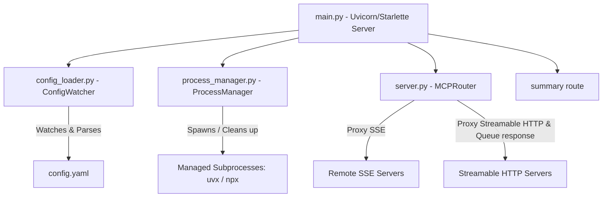

# 🔀 MCP Mux

> **Dynamic Multi-Endpoint Python Model Context Protocol (MCP) Router & Orchestrator**

`mcp-mux` is a dynamic MCP server orchestrator and multiplexer. It acts as a central proxy to multiple remote and local sub-MCP servers, monitoring a `config.yaml` file to hot-reload endpoints live without server restarts. It supports both Server-Sent Events (SSE) and stateless Streamable HTTP backend transports, automatically bridging client connections and forwarding session identifiers to suppress capability warnings. It also provides a lightweight `/summary` endpoint to minimize context token flooding for AI agents.

---

## 🌟 Key Features

- 🔄 **Dynamic Hot-Reloading**: Uses an asynchronous config watcher to poll configuration changes and dynamically register or unregister server endpoints on the fly.
- 🚀 **Flexible Sub-Server Modes**:
  - **Remote**: Seamless proxying to external HTTP MCP endpoints.
  - **Managed CLI**: Native spawning of command-line tools (e.g., via `npx` or `uvx`).
  - **Stdio Bridge**: Spawns stdout/stdin-based MCP servers and proxies them.
- 🌉 **Local SSE-to-Streamable-HTTP Bridge**: Resolves transport mismatch when traditional SSE clients (which expect a `GET` request to establish a persistent channel) attempt to connect to stateless `streamable-http` backends (which only accept `POST` and `DELETE` requests) by converting POST response streams to client-specific local SSE queues.
- ⚡ **Automatic Transport Auto-Detection**: Dynamically detects the backend transport mode (`streamable-http` vs `sse`) based on URL paths. Sub-servers with `/mcp` or `/mcp/` in their URL automatically default to `streamable-http`.
- 🛡️ **Session Propagation & Warnings Suppression**: Forwards the client's `Mcp-Session-Id` header to remote streamable-http backends during bridged requests. This ensures downstream JS/TS FastMCP servers cache client capabilities correctly and suppresses warnings like `could not infer client capabilities`.
- 📊 **Token-Saving Metadata Endpoint**: Registers a custom `/summary` route returning only namespaces and descriptions, shielding AI clients from schema bloat.
- 🧹 **Clean Subprocess Lifecycle**: The manager isolates background subprocesses inside unique Unix process groups (`os.setsid`) to guarantee no zombie processes are left behind on teardown.

---

## 📐 Architecture



---

## ⚙️ Configuration (`config.yaml`)

Define your endpoints in `mcp_router/config.yaml`. Here is an example layout:

```yaml
endpoints:
  # Remote HTTP Mode
  - path: "web-search"
    mode: "remote"
    url: "https://mcp.garion.us/mcp"
    summary: "Google Search and content extraction tool"
    # transport: "streamable-http"  (Automatically detected due to /mcp path suffix)

  # Managed CLI Mode (On-Demand)
  - path: "firecrawl"
    mode: "managed_cli"
    command: "export NVM_DIR=$HOME/.config/nvm && [ -s $NVM_DIR/nvm.sh ] && . $NVM_DIR/nvm.sh && HTTP_STREAMABLE_SERVER=true PORT=3033 HOST=localhost FIRECRAWL_API_URL=http://garion.us:3002 npx --yes firecrawl-mcp"
    url: "http://localhost:3033/mcp"
    summary: "Firecrawl Web Content Extraction Tool"
    timeout: 300  # Automatically shuts down after 300 seconds of inactivity
```

### Configuration Parameters

| Parameter | Type | Required | Description |
|---|---|---|---|
| `path` | String | Yes | Unique namespace/route for the sub-server. |
| `mode` | String | Yes | Spawning mode (`remote`, `managed_cli`, or `stdio_bridge`). |
| `url` | String | Yes (for remote/managed) | Target endpoint URL. |
| `command` | String | Yes (for managed/stdio) | Command string to spawn the server process. |
| `summary` | String | Yes | Brief description of the sub-server, returned by `/summary`. |
| `timeout` | Integer | No | Inactivity timeout in seconds for CLI mode (defaults to 300). |
| `transport` | String | No | Transport mode (`sse` or `streamable-http`). Automatically detected if omitted. |

---

## 🚀 Getting Started

### Prerequisites
Make sure you have [uv](https://github.com/astral-sh/uv) installed.

### 1. Installation & Setup

Clone the repository and install all dependencies:
```bash
# Activate virtual environment
source .venv/bin/activate

# Install & sync dependencies
uv sync
```

### 2. Running the Orchestrator

Start the main router server (default port is `8012`):
```bash
uv run python main.py --port 8012
```

### 3. Querying Endpoint Summary
You can check active routes and summaries by visiting:
```bash
curl http://127.0.0.1:8012/summary
```

---

## 🧪 Testing

The project is fully tested using `pytest` and `pytest-asyncio`. To execute unit tests:

```bash
uv run pytest
```
